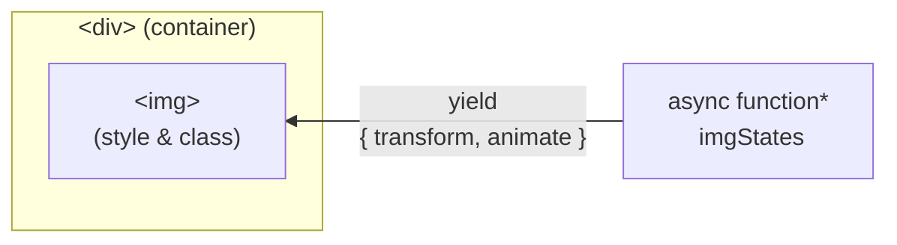
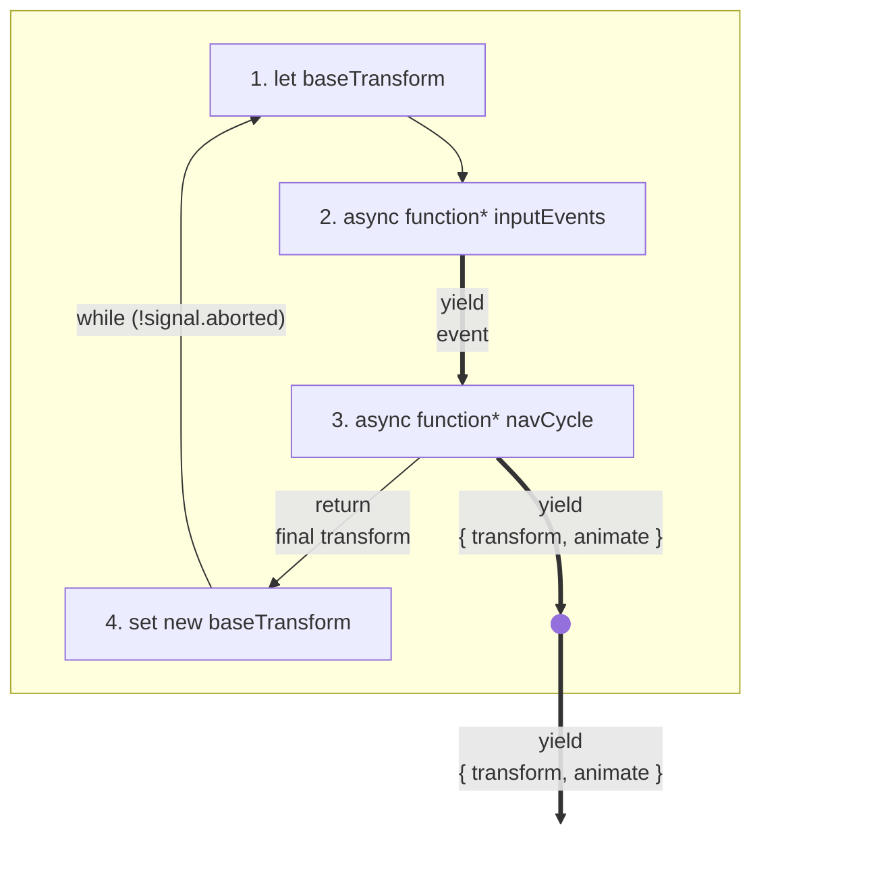
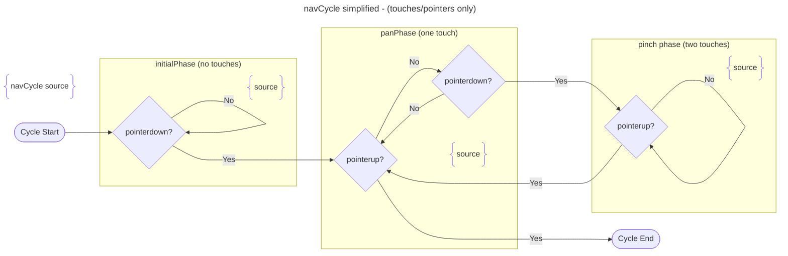

# Async Iterators Pan Pinch Demo

## 🙌 Async Iterators are great 😃

_Yes, async iterators are great!_ 🎉

This repo demonstrates a real world implementation of pan & pinch gesture logic implemented with [JavaScript async iterators](https://developer.mozilla.org/en-US/docs/Web/JavaScript/Reference/Global_Objects/AsyncIterator) inside a minimal [React](https://react.dev) app.

⭐ **Featuring** ⭐

- async iterators as a state machine
- no additional libraries (except for [React](https://react.dev) and [TypeScript](https://www.typescriptlang.org))
- lots of immutability and a little bit of JavaScript magic from [async function \*](https://developer.mozilla.org/en-US/docs/Web/JavaScript/Reference/Statements/async_function*) and [yield](https://developer.mozilla.org/en-US/docs/Web/JavaScript/Reference/Operators/yield)

## ⚡️ See it live

See the project live at [https://jonelantha.github.io/async-iterators-pan-pinch-demo/](https://jonelantha.github.io/async-iterators-pan-pinch-demo/)

## 🔧 Setup

```bash
npm install
npm run dev
```

## 🔍 How it works

### Overview



The `<App>` React component is composed of an `` element inside a container `<div>` element.

As the user interacts with the image, [CSS Transforms](https://developer.mozilla.org/en-US/docs/Web/CSS/transform) are applied to the ``'s style - this repositions the image relative to the container.

In certain situations an `.animate` class is also added to the ``, for example if the `` should animate to the next transform position (the styles for the `.animate` class includes a [CSS Transition](https://developer.mozilla.org/en-US/docs/Web/CSS/transition) for the transform property).

The values for these attributes are supplied by the [imgStates async iterator](#imgstates-async-iterator), see below.

### imgStates async iterator

The **imgStates** async iterator yields a series of `{ transform, animate }` values:

- `transform: DOMMatrix` - transform to apply to the `` (stored as a [DOMMatrix](https://developer.mozilla.org/en-US/docs/Web/API/DOMMatrix))
- `animate: boolean | undefined` - whether to add the `.animate` class to the ``

#### In brief:

The **imgStates** async iterator yields its values straight from another async iterator, **navCycle**. **navCycle** is a finite async iterator; one complete iteration cycle of **navCycle** represents a single user interaction (see [Navigation Cycles](#navigation-cycles---navcycle-async-iterator) below). Once a cycle of **navCycle** has completed a new cycle will begin.

#### In detail:



1. **baseTransform** is the starting transform for the next navigation cycle, intitially set to the default matrix (no transform)
2. **inputEvents** is an async iterator of events from the **container** element (the parent `<div/>`). Those events are [PointerEvent](https://developer.mozilla.org/en-US/docs/Web/API/PointerEvent), [KeyboardEvent](https://developer.mozilla.org/en-US/docs/Web/API/KeyboardEvent) and [WheelEvent](https://developer.mozilla.org/en-US/docs/Web/API/WheelEvent)
3. **navCycle** is an async iterator representing a single navigation cycle (see [Navigation Cycles](#navigation-cycles---navcycle-async-iterator) below). **navCycle** takes two parameters: the **baseTransform** from step 1 and the **inputEvents** async iterator from step 2. It yields a series of `{ transform, animate }` values, these values are in turn yielded by the enclosing **imgStates** async iterator (using [yield \*](https://developer.mozilla.org/en-US/docs/Web/JavaScript/Reference/Operators/yield*)).
4. When done, **navCycle** returns the final transform of the navigation cycle. This return value is assigned to **baseTransform** and will be used as the starting transform for the next navigation cycle. A while loop returns to step 1 (unless the signal has been aborted).

_[[complete imgStates source](./src/App.tsx#L12-L18)]_

### Navigation Cycles - navCycle async iterator

One full iteration of the **navCycle** async iterator represents a single user interaction, for example:

- dragging with the mouse and releasing the mouse button
- a series of overlapping multi-touch gestures (the cycle ends when the last touch is released)
- a single press of an arrow key

#### Phases

The **navCycle** async iterator is divided into phases where each phase corresponds to a particular gesture, for example pan or pinch. Execution passes between the phases depending on pointer events:



- **initialPhase** - waiting for the first event _[[source](./src/navCycle.ts#L15-L41)]_
  - can transfer to the **panPhase** if a pointer goes down
  - can process a **KeyboardEvent** or a **WheelEvent** and end iteration
- **panPhase** - the user has one pointer down and is performing a pan (drag) gesture _[[source](./src/navCycle.ts#L43-L95)]_
  - can transfer to **pinchPhase** if a second pointer becomes down
  - can end iteration if the current pointer is released
- **pinchPhase** - the user has two pointers down and is performing a pinch gesture _[[source](./src/navCycle.ts#L97-L136)]_
  - can transfer back to a **panPhase** if one pointer is released

_[[complete navCycle source](./src/navCycle.ts)]_

### Aborting

Pressing `Esc` in the middle of a cycle cancels the gesture and makes the image slide back to the previous location (for example the user could press `Esc` to abort a pan operation)

Implementation of aborting:

- User presses `Esc`
- A **KeyboardEvent** for `Esc` is yielded from the **inputEvents** async iterator and processed by the **navCycle** async iterator
- If execution is currently inside a gesture phase then **navCycle** will throw an Error and no more processing of the cycle occurs _[[source](./src/navCycle.ts#L88-L92)]_
- The Error is then caught by the top level of the **navCycle** iterator _[[source](./src/navCycle.ts#L5-L11)]_
- **navCycle** then yields `{ transform: baseTransform, animate: true }` which causes the `` element to slide back to the initial position of the cycle _[[source](./src/navCycle.ts#L8)]_
- A new cycle is started

## 🤓 Find out more

Blog article coming soon...
